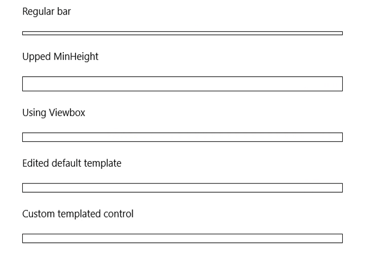

# ProgressBarTemplateSettings Sample

This repository contains a sample solution showing possible alternative to tweak the dot size of your ProgressBar control.

The same approach can be used to tweak templates of following controls using [template setting classes](https://msdn.microsoft.com/en-us/windows/uwp/xaml-platform/template-settings-classes):

 * ComboBox
 * ProgressRing
 * SettingsFlyout
 * ToggleSwitch
 * ToolTip
 * GridViewItem
 * ListViewItem

Blog post: http://www.bartlannoeye.com/blog/use-templatesettings-to-tweak-your-progressbar

